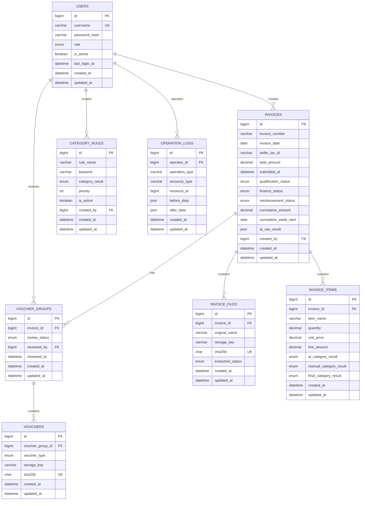

# 数据库设计说明

本文件对应 `sql/schema.sql`，用于材料费发票智能预审与管理平台的 MySQL 8 初始化。

## 表关系图

## 字段说明

### `users` 用户表

| 字段 | 类型 | 说明 |
|---|---|---|
| `id` | BIGINT | 用户主键。|
| `username` | VARCHAR(64) | 登录用户名，唯一。|
| `password_hash` | VARCHAR(255) | bcrypt 等算法生成的密码哈希，不保存明文密码。|
| `role` | ENUM | 角色：`admin` 管理员、`user` 普通用户、`finance` 财务、`reviewer` 审核人员。当前版本主要使用 `admin`。|
| `is_active` | BOOLEAN | 是否允许登录。|
| `last_login_at` | DATETIME | 最近一次登录时间。|
| `created_at` / `updated_at` | DATETIME | 创建和最后更新时间。|

### `category_rules` 长期品类规则表

| 字段 | 类型 | 说明 |
|---|---|---|
| `id` | BIGINT | 规则主键。|
| `rule_name` | VARCHAR(128) | 管理员可读的规则名称。|
| `keyword` | VARCHAR(128) | 匹配商品名称或描述的关键词。|
| `category_result` | ENUM | 规则结果：`可以`、`存疑`、`不可以`。|
| `priority` | INT | 规则优先级，数值越小优先级越高。|
| `is_active` | BOOLEAN | 是否启用该规则。|
| `created_by` | BIGINT | 创建规则的用户。|
| `created_at` / `updated_at` | DATETIME | 创建和最后更新时间。|

### `invoices` 发票主表

| 字段 | 类型 | 说明 |
|---|---|---|
| `id` | BIGINT | 发票主键。|
| `invoice_number` | VARCHAR(64) | 发票号码。|
| `invoice_date` | DATE | 开票日期。|
| `seller_name` / `seller_tax_id` | VARCHAR | 销售方名称和纳税人识别号。自然周累计按 `seller_tax_id` 分组。|
| `total_amount` | DECIMAL(12,2) | 价税合计，用于自然周累计。|
| `submitted_at` | DATETIME | 提交审核时间，自然周计算的时间依据。|
| `qualification_status` | ENUM | 资质审核状态：待审核、待补凭证、待人工处理、审核通过、审核不通过、已取消。数据库中使用英文稳定值。|
| `finance_status` | ENUM | 财务提交状态：未提交、已提交。|
| `reimbursement_status` | ENUM | 最终报销状态：未完成、报销成功、报销失败。|
| `qualification_reason` | TEXT | 规则引擎或人工审核说明。|
| `cumulative_amount` | DECIMAL(12,2) | 本次审核时计算出的同销售方同自然周有效累计金额。|
| `cumulative_week_start` | DATE | 自然周周一日期，便于索引和追溯。|
| `source_batch_id` | CHAR(36) | 上传批次 UUID，用于追踪单个文件或 ZIP 批次。|
| `ai_raw_result` | JSON | AI 原始结构化结果，只作为辅助证据，不覆盖人工结果。|
| `manual_note` | TEXT | 管理员补充说明。|
| `created_by` | BIGINT | 创建发票档案的用户。|
| `created_at` / `updated_at` | DATETIME | 创建和最后更新时间。|

### `invoice_files` 发票文件表

| 字段 | 类型 | 说明 |
|---|---|---|
| `id` | BIGINT | 文件记录主键。|
| `invoice_id` | BIGINT | 所属发票。|
| `original_name` | VARCHAR(255) | 用户上传时的原始文件名。|
| `storage_key` | VARCHAR(512) | 后端存储标识，不向前端暴露绝对路径。|
| `mime_type` | VARCHAR(128) | 文件 MIME 类型。|
| `file_size` | BIGINT | 文件大小，单位字节。|
| `sha256` | CHAR(64) | 文件内容哈希，用于去重和追溯。|
| `extraction_status` | ENUM | PDF/OCR 提取状态：待处理、成功、失败。|
| `extraction_error` | TEXT | 文件处理失败原因。|
| `created_at` / `updated_at` | DATETIME | 创建和最后更新时间。|

### `invoice_items` 发票商品明细表

| 字段 | 类型 | 说明 |
|---|---|---|
| `id` | BIGINT | 商品明细主键。|
| `invoice_id` | BIGINT | 所属发票。|
| `item_name` | VARCHAR(255) | 商品名称。|
| `specification` | VARCHAR(255) | 规格型号。|
| `unit` | VARCHAR(32) | 商品单位。|
| `quantity` | DECIMAL(12,4) | 数量。|
| `unit_price` | DECIMAL(12,2) | 含税单价，用于材料、低值品和资产判断。|
| `line_amount` | DECIMAL(12,2) | 该商品行含税金额。|
| `tax_rate` | DECIMAL(6,4) | 税率。|
| `ai_category_result` | ENUM | AI 判断结果，只能是可以、存疑、不可以。|
| `manual_category_result` | ENUM | 管理员人工判断结果。|
| `final_category_result` | ENUM | 当前生效的最终品类结果。|
| `category_reason` | TEXT | 品类判断依据。|
| `created_at` / `updated_at` | DATETIME | 创建和最后更新时间。|

### `voucher_groups` 凭证组表

| 字段 | 类型 | 说明 |
|---|---|---|
| `id` | BIGINT | 凭证组主键。|
| `invoice_id` | BIGINT | 所属发票；一张发票可以有多个凭证组。|
| `group_name` | VARCHAR(128) | 凭证组名称或备注。|
| `review_status` | ENUM | 人工核验状态：待审核、审核通过、审核不通过。|
| `reviewed_by` | BIGINT | 执行凭证审核的用户。|
| `reviewed_at` | DATETIME | 凭证审核时间。|
| `review_note` | TEXT | 凭证审核说明。|
| `created_at` / `updated_at` | DATETIME | 创建和最后更新时间。|

### `vouchers` 凭证文件表

| 字段 | 类型 | 说明 |
|---|---|---|
| `id` | BIGINT | 凭证主键。|
| `voucher_group_id` | BIGINT | 所属凭证组。|
| `voucher_type` | ENUM | 凭证类型：订单截图或支付记录；同一凭证组各只能有一份。|
| `original_name` | VARCHAR(255) | 原始文件名。|
| `storage_key` | VARCHAR(512) | 后端存储标识。|
| `mime_type` | VARCHAR(128) | 文件 MIME 类型。|
| `file_size` | BIGINT | 文件大小，单位字节。|
| `sha256` | CHAR(64) | 文件内容哈希。|
| `created_at` / `updated_at` | DATETIME | 创建和最后更新时间。|

### `operation_logs` 操作日志表

| 字段 | 类型 | 说明 |
|---|---|---|
| `id` | BIGINT | 日志主键。|
| `operator_id` | BIGINT | 执行操作的用户，可为空以保留系统任务日志。|
| `operation_type` | VARCHAR(64) | 操作类型，如上传、审核、修改、提交财务。|
| `resource_type` | VARCHAR(64) | 被操作资源类型，如 invoice、voucher_group。|
| `resource_id` | BIGINT | 被操作资源 ID。|
| `before_data` / `after_data` | JSON | 变更前后的关键数据快照。|
| `ip_address` | VARCHAR(45) | 操作来源 IP，兼容 IPv4 和 IPv6。|
| `user_agent` | VARCHAR(512) | 操作客户端信息。|
| `created_at` / `updated_at` | DATETIME | 创建和最后更新时间。|

## 规则落库说明

- 单价 `< 500`、`500-999.99`、`>= 1000` 的判断由业务规则服务执行，数据库保存 `unit_price`，不把规则硬编码到表结构中。
- 自然周累计使用 `seller_tax_id`、`cumulative_week_start`、`submitted_at` 和 `total_amount`，实际计算时只纳入有效状态。
- 一张发票可以有多个 `voucher_groups`；每个凭证组通过唯一约束保证最多一张订单截图和一条支付记录。
- AI 结果和人工结果分开保存，管理员修改不会覆盖 `ai_category_result` 或 `ai_raw_result`。
